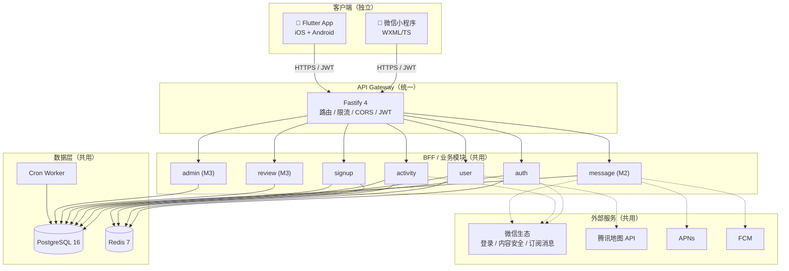
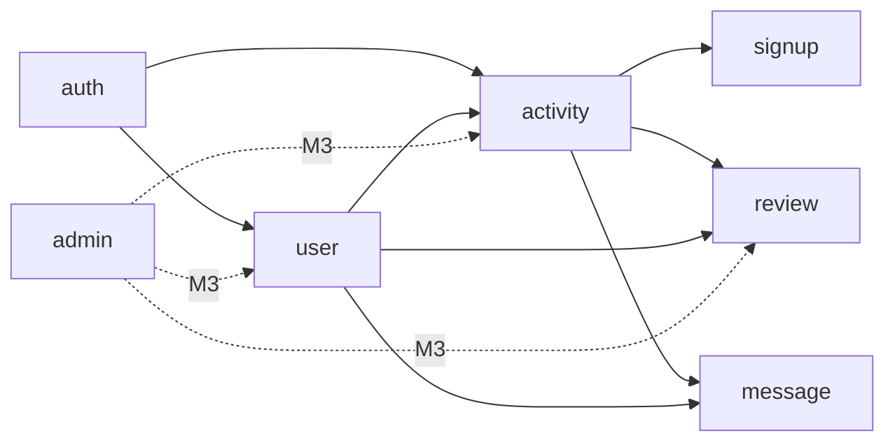
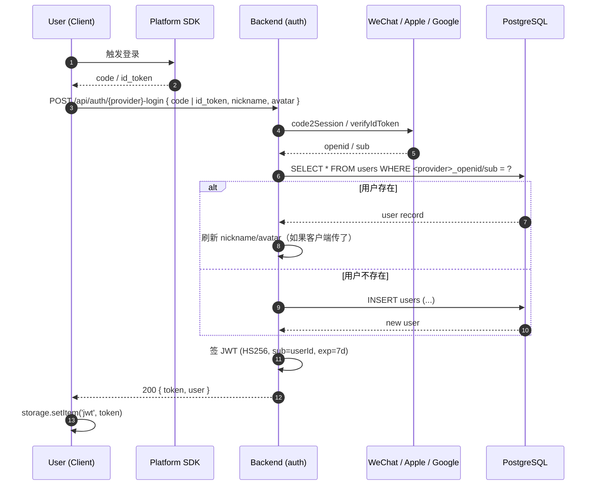
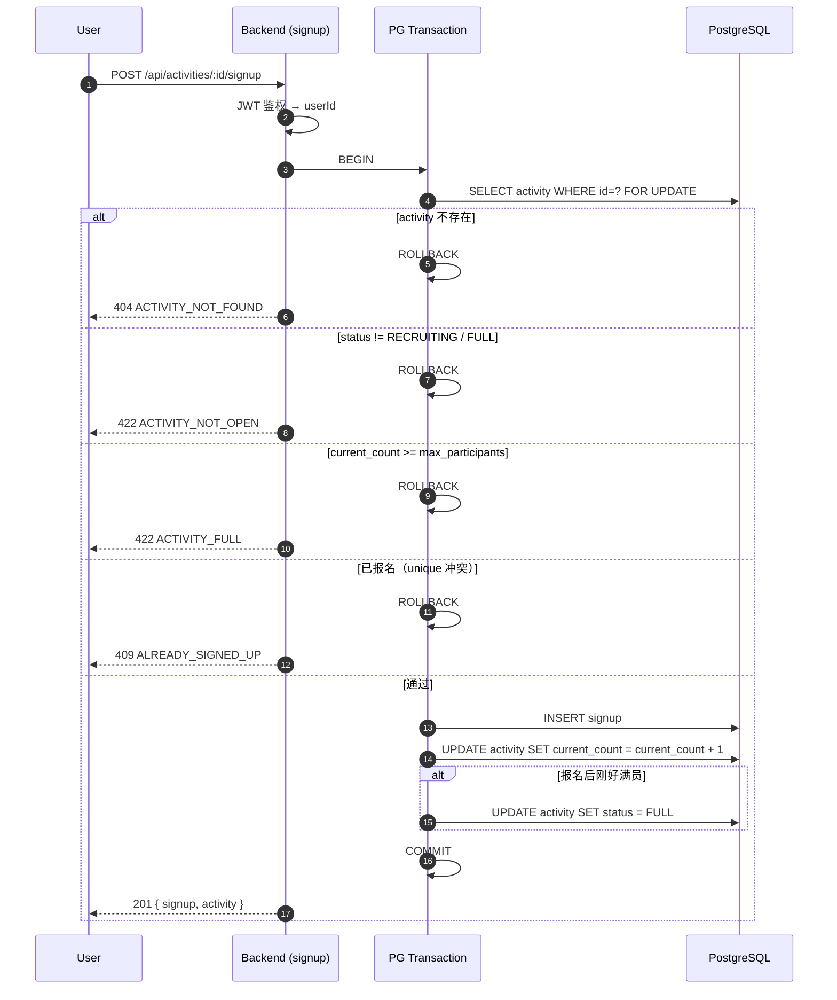
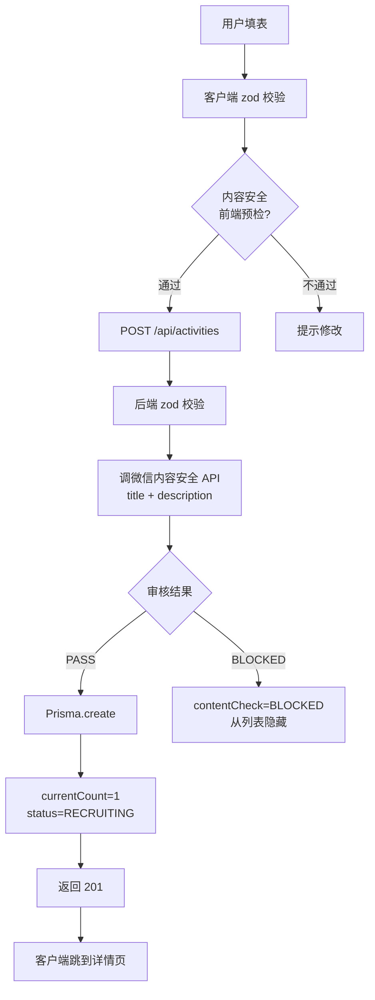
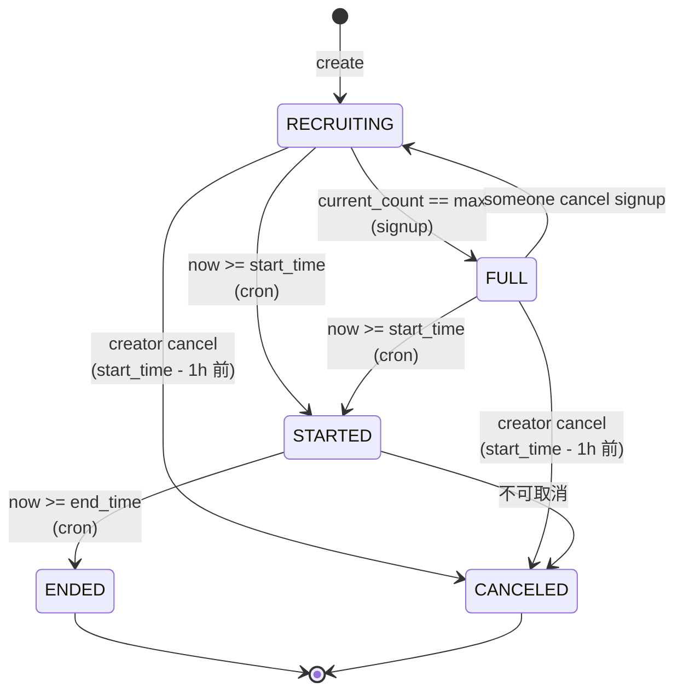
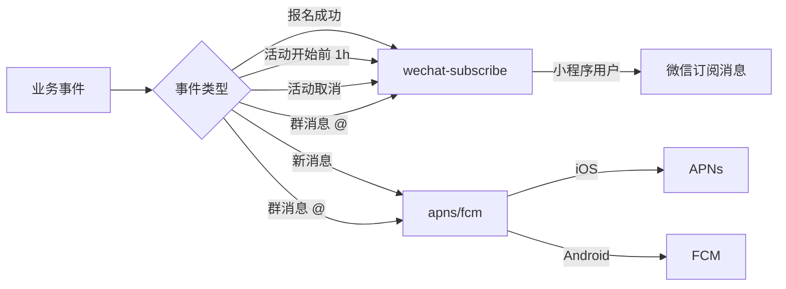

# StudyBuddy — 系统架构 v1.0

> **作者**：@Oracle Hermes（CTO, Mavis / architect agent）
> **决策人**：@YuanshuoDu
> **生效日期**：2026-06-05
> **状态**：v1.0 — 与 CTO 总体规划 `studybuddy-plan/cto-roadmap-v1.0.md` 对齐
> **配套文档**：[`docs/spec-v0.2.md`](./spec-v0.2.md) · [`docs/api/v1.md`](./api/v1.md) · [`docs/adr/`](./adr/)
> **演进基线**：[`docs/architecture.md`](./architecture.md)（v0.1，仅微信小程序）— 保留作历史参考

> ⚠️ **交付铁律**：本文件每条结论必须可验证、可评审。详见 [`docs/delivery-standards.md`](./delivery-standards.md)

---

## 0. TL;DR（一页概览）

| 维度 | 决策 | 文档位置 |
|------|------|----------|
| 三端 | **微信小程序原生** + **Flutter（iOS + Android）** | [ADR-0001](./adr/0001-flutter-for-mobile.md) / [ADR-0002](./adr/0002-miniprogram-native.md) |
| 后端 | **Node 20 + TypeScript + Fastify 4 + Prisma 5**（100% 共用） | §3 |
| 数据库 | **PostgreSQL 16 + Redis 7** | §3.4 |
| 鉴权 | **微信 openid（小程序）+ Apple ID（iOS）+ Google（Android）** → 合并到同一 `User` | [ADR-0003](./adr/0003-auth-strategy.md) |
| 活动生命周期 | **5 态状态机** + Cron 扫描 | [ADR-0004](./adr/0004-state-machine-for-activity.md) |
| 数据存储地域 | **国内 → 腾讯云** / **海外 → AWS** | [ADR-0005](./adr/0005-data-storage-region.md) |
| 地图 | 腾讯地图（GCJ-02）三端一致 | §7.1 |
| 推送 | 微信订阅消息 + APNs + FCM | §7.2 |
| 内容审核 | 微信内容安全 API | §7.3 |

---

## 1. 背景与目标

### 1.1 业务定位

StudyBuddy = 留学生搭子活动平台。**让留学生 30 秒内找到一个能一起去图书馆 / 打球 / 开黑的搭子。**

### 1.2 目标用户

| 画像 | 描述 | 主要场景 |
|------|------|----------|
| A 学业型 | 硕士 / 博士新生 | 自习、讨论、找同专业同学 |
| B 运动型 | 喜欢打球 / 跑步 | 周末约球、夜跑 |
| C 娱乐型 | 想玩桌游 / 开黑 | 周中开黑、周末桌游局 |
| D 社交型 | 想认识新朋友 | 主题局、城市探索 |

### 1.3 12 周路线图（来自 CTO 规划）

- **M1（W1–W4）基础建设**：本文件 + API v1 + 后端骨架 + 小程序 / Flutter 脚手架 + 登录闭环
- **M2（W5–W8）核心闭环 + 内测**：评价、消息、推送、性能、50 人灰度
- **M3（W9–W12）发布 + 运营**：审核、正式发布、监控、v1.1 复盘

**M1 出口标准（与本架构直接挂钩）**：
- 小程序可走通：登录 → 浏览活动 → 报名 → 创建活动
- Flutter App 同样闭环（iOS / Android 模拟器）
- 后端 90% 接口有自动化测试，CI 全绿
- 三端 100% 共用同一套后端 API

---

## 2. 三端技术栈对照

> **核心原则**：后端 100% 共用，客户端按平台特性独立实现。详细见 [ADR-0001](./adr/0001-flutter-for-mobile.md) / [ADR-0002](./adr/0002-miniprogram-native.md)。

| 层 | 微信小程序（原生） | Flutter App（iOS + Android） | 后端（共用） |
|----|--------------------|------------------------------|---------------|
| 语言 | **TypeScript** + WXML/WXSS | **Dart 3.x** | **TypeScript 5.4** |
| 框架 | 微信原生 + Vite 编译 | **Flutter 3.x** | **Fastify 4.x** |
| 状态管理 | Mobx-miniprogram / 自研 | **Riverpod 2.x** | — |
| 路由 | 微信原生 `Page` | **GoRouter** | **Fastify Router** |
| 网络层 | `wx.request` 封装 + `Adapter` | **Dio 5 + Interceptor** | — |
| 本地存储 | `wx.setStorageSync` | **shared_preferences / Hive** | — |
| 鉴权 | `wx.login` → 后端换 JWT | **Sign in with Apple** / **Google Sign-In** → 后端换 JWT | **JWT (HS256, 7d)** |
| 地图 | **腾讯地图 JavaScript SDK** | **腾讯地图 Flutter Plugin** | — |
| 推送 | **微信订阅消息** | **APNs**（iOS）/ **FCM**（Android） | 统一推送网关 → 三通道 |
| 内容审核 | **微信内容安全 API**（前端 + 后端双校验） | 同上 | 后端再过一道 |
| CI | 微信开发者工具 + 自研脚本 | **GitHub Actions + Flutter SDK** | **GitHub Actions** |
| 包管理 | `pnpm` | `flutter pub` | `pnpm 9` |
| 测试 | miniprogram-automator | `flutter test` + integration_test | vitest |
| 端上规范 | 微信设计规范 + 自研设计系统 | iOS Human Interface / Material 3 + 自研设计系统 | — |

### 2.1 三端边界



> **解读**：客户端是「薄客户端」— 渲染 + 交互 + 调用 SDK；**所有业务规则在后端**，避免三端规则漂移。

---

## 3. 后端架构

### 3.1 总体形态

后端采用 **Fastify 4 模块化单体（Modular Monolith）**。M1 阶段不分微服务；当模块边界出现性能或团队冲突时再拆。

```
server/
├── src/
│   ├── modules/                  # 业务模块（自包含）
│   │   ├── auth/                 # 微信 / Apple / Google 登录、JWT、刷新
│   │   ├── user/                 # 用户 CRUD、主页、设置
│   │   ├── activity/             # 活动 CRUD、列表筛选、状态机
│   │   ├── signup/               # 报名 / 退出、容量校验、事务
│   │   ├── message/              # 群消息（M2）
│   │   ├── review/               # 评价（M3）
│   │   └── admin/                # 后台（M3）
│   ├── plugins/                  # Fastify 插件（auth / rate-limit / error / tracing）
│   ├── lib/                      # 基础设施（prisma / redis / oss / logger / config）
│   ├── jobs/                     # 定时任务（Cron Worker）
│   │   └── activity-state-cron.ts
│   ├── types/                    # 共享 TS 类型
│   ├── app.ts                    # Fastify 实例 + 路由注册
│   └── server.ts                 # 启动入口
├── prisma/
│   ├── schema.prisma             # 数据模型 v1
│   ├── migrations/               # 迁移历史
│   └── seed.ts
├── tests/                        # vitest
└── ...
```

### 3.2 模块依赖图



**模块依赖规则**：
- ✅ 只能向下依赖（auth → user → activity → signup）
- ❌ 禁止反向依赖（activity → auth 不可取）
- ❌ 禁止循环依赖
- 🔒 跨模块访问必须通过 `module.exports` 暴露的 service

### 3.3 请求生命周期

```
HTTP Request
  → @fastify/cors          (CORS 处理)
  → @fastify/helmet        (安全头)
  → @fastify/rate-limit    (Redis 滑动窗口限流)
  → JWT Verify Plugin      (Authorization: Bearer ...)
  → @fastify/multipart     (文件上传，仅 admin / 头像)
  → Route Handler
      → zod Schema 校验
      → Service 层业务逻辑
          → Prisma (PG) ──┐
          → Redis 缓存  ──┴→ 事务
      → Response (统一 envelope)
  → 错误处理 (RFC 7807 Problem Details)
  → @fastify/request-id    (X-Request-Id 注入)
  → 访问日志 + 监控埋点
```

### 3.4 数据层选型

| 组件 | 选型 | 角色 | 备注 |
|------|------|------|------|
| 主库 | **PostgreSQL 16** | 持久化、事务、地理查询 | Decimal(10,7) 存 lat/lng；M2 起可选 PostGIS |
| 缓存 | **Redis 7** | 热数据缓存、限流计数、Session、JWT 黑名单 | 哨兵模式 |
| 对象存储 | 腾讯云 COS / AWS S3 | 头像、活动封面、UGC 图片 | 与部署地域绑定 |
| 消息队列 | **BullMQ**（v0.3 评估） | 异步任务（推送、内容审核、邮件） | M1 阶段先 inline 调外部 API |

### 3.5 第三方 SDK 依赖

| 用途 | 选型 | 落地位置 | 关键配置 |
|------|------|----------|----------|
| 微信登录 | `wechat-api` 自行封装 | `server/src/lib/wx/` | AppID / AppSecret（仅后端） |
| 微信内容安全 | `https://api.weixin.qq.com/wxa/msg_sec_check` | `server/src/lib/wx/msg-sec.ts` | access_token Redis 缓存（TTL 7000s） |
| 微信订阅消息 | `https://api.weixin.qq.com/cgi-bin/message/subscribe/send` | `server/src/lib/wx/subscribe.ts` | 模板 ID 申请见 ADR-0001 |
| Apple 登录 | `apple-signin-auth` | `server/src/lib/apple/` | JWT 公钥由 Apple JWKS 缓存 |
| Google 登录 | `google-auth-library` | `server/src/lib/google/` | ClientID / ClientSecret |
| 腾讯地图 | 腾讯位置服务 WebService API | `server/src/lib/map/` | Key + Signature 签名 |
| 推送 | 微信订阅消息 + APNs（`@parse/node-apn`）+ FCM（`firebase-admin`） | `server/src/lib/push/` | 见 §7.2 |

---

## 4. 数据模型 v1（Prisma Schema）

> **落地文件**：[`server/prisma/schema.prisma`](../../server/prisma/schema.prisma)（与本节一一对应）

```prisma
// =====================================================================
// datasource / generator
// =====================================================================
generator client {
  provider = "prisma-client-js"
}

datasource db {
  provider = "postgresql"
  url      = env("DATABASE_URL")
}

// =====================================================================
// Enums
// =====================================================================

enum UserStatus          { ACTIVE  BANNED }
enum ActivityType        { STUDY   SPORTS  BOARD_GAME  ONLINE_GAME  OTHER }
enum ActivityStatus      { RECRUITING  FULL  STARTED  ENDED  CANCELED }
enum SignupStatus        { PENDING  APPROVED  REJECTED  CANCELED }
enum ContentCheckStatus  { PENDING  PASS  BLOCKED }
enum AuthProvider        { WECHAT  APPLE  GOOGLE }   // 多端登录合并（ADR-0003）

// =====================================================================
// User
// =====================================================================
model User {
  id          String        @id @default(cuid())
  // 鉴权：每个登录来源的 openid / sub 必须唯一
  wechatOpenid String?      @unique @map("wechat_openid")
  appleSub     String?      @unique @map("apple_sub")
  googleSub    String?      @unique @map("google_sub")
  primaryProvider AuthProvider @default(WECHAT) @map("primary_provider")

  // 资料
  nickname    String
  avatar      String?
  school      String?
  major       String?
  grade       String?       // 入学年份（自报，不做认证）
  wechatId    String?       @map("wechat_id")   // 展示用，需用户授权
  phone       String?       @unique
  bio         String?       @db.VarChar(500)
  status      UserStatus    @default(ACTIVE)

  // 软删除
  deletedAt   DateTime?     @map("deleted_at")

  createdAt   DateTime      @default(now()) @map("created_at")
  updatedAt   DateTime      @updatedAt      @map("updated_at")

  activities  Activity[]    @relation("creator")
  signups     Signup[]
  messages    Message[]
  reviewsFrom Review[]      @relation("review_from")
  reviewsTo   Review[]      @relation("review_to")

  @@index([school, grade])
  @@map("users")
}

// =====================================================================
// Activity
// =====================================================================
model Activity {
  id              String             @id @default(cuid())
  creatorId       String             @map("creator_id")
  creator         User               @relation("creator", fields: [creatorId], references: [id])

  type            ActivityType
  title           String             @db.VarChar(100)
  description     String             @db.VarChar(2000)
  coverUrl        String?            @map("cover_url")

  // 位置（GCJ-02 腾讯坐标系，统一存储）
  locationName    String             @map("location_name")
  locationAddr    String             @map("location_addr")
  locationLat     Decimal            @map("location_lat") @db.Decimal(10, 7)
  locationLng     Decimal            @map("location_lng") @db.Decimal(10, 7)

  startTime       DateTime           @map("start_time")
  endTime         DateTime           @map("end_time")
  maxParticipants Int                @default(10) @map("max_participants")
  currentCount    Int                @default(1) @map("current_count")   // 含创建者
  tags            String[]

  status          ActivityStatus     @default(RECRUITING)
  contentCheck    ContentCheckStatus @default(PENDING) @map("content_check")
  blockedReason   String?            @map("blocked_reason")

  createdAt       DateTime           @default(now()) @map("created_at")
  updatedAt       DateTime           @updatedAt      @map("updated_at")
  canceledAt      DateTime?          @map("canceled_at")

  signups         Signup[]

  @@index([status, startTime])
  @@index([type, status, startTime])
  @@index([locationLat, locationLng])
  @@map("activities")
}

// =====================================================================
// Signup
// =====================================================================
model Signup {
  id          String       @id @default(cuid())
  activityId  String       @map("activity_id")
  userId      String       @map("user_id")
  activity    Activity     @relation(fields: [activityId], references: [id], onDelete: Cascade)
  user        User         @relation(fields: [userId], references: [id])

  status      SignupStatus @default(APPROVED)   // MVP 默认自动通过
  message     String?      @db.VarChar(200)     // 报名留言（走内容审核）
  signedAt    DateTime     @default(now()) @map("signed_at")
  canceledAt  DateTime?    @map("canceled_at")
  cancelReason String?     @map("cancel_reason")

  @@unique([activityId, userId])
  @@index([userId, status])
  @@index([activityId, status])
  @@map("signups")
}

// =====================================================================
// Message (M2 群消息)
// =====================================================================
model Message {
  id          String   @id @default(cuid())
  activityId  String   @map("activity_id")
  senderId    String   @map("sender_id")
  content     String   @db.VarChar(2000)
  contentCheck ContentCheckStatus @default(PENDING) @map("content_check")
  createdAt   DateTime @default(now()) @map("created_at")

  sender      User     @relation(fields: [senderId], references: [id])

  @@index([activityId, createdAt])
  @@map("messages")
}

// =====================================================================
// Review (M3 评价)
// =====================================================================
model Review {
  id          String   @id @default(cuid())
  activityId  String   @map("activity_id")
  fromUserId  String   @map("from_user_id")
  toUserId    String   @map("to_user_id")

  rating      Int      // 1-5
  comment     String?  @db.VarChar(500)
  createdAt   DateTime @default(now()) @map("created_at")

  fromUser    User     @relation("review_from", fields: [fromUserId], references: [id])
  toUser      User     @relation("review_to",   fields: [toUserId],   references: [id])

  @@unique([activityId, fromUserId, toUserId])
  @@index([toUserId, createdAt])
  @@map("reviews")
}
```

### 4.1 字段约束

| 模型 | 字段 | 约束 | 校验位置 |
|------|------|------|----------|
| User | phone | E.164 格式 | zod |
| User | bio | ≤ 500 | zod + 微信内容安全 |
| Activity | title | 5–100 字 | zod |
| Activity | description | 10–2000 字 | zod + 微信内容安全 |
| Activity | max_participants | 2–100 | zod |
| Activity | end_time | > start_time | zod |
| Activity | location_lat | -90 ~ 90, 7 位小数 | zod |
| Activity | tags | 0–10 个，每项 ≤ 20 字 | zod |
| Signup | (activity_id, user_id) | 唯一 | DB + Prisma |
| Review | rating | 1–5 | zod |

### 4.2 索引策略

| 表 | 索引 | 命中场景 |
|----|------|----------|
| users | `(school, grade)` | 「同学校 / 同年级」筛选（v1.1 推荐用） |
| users | `wechat_openid` / `apple_sub` / `google_sub` | 三端登录查找 |
| activities | `(status, start_time)` | 列表默认按状态 + 时间排序 |
| activities | `(type, status, start_time)` | 列表按类型 + 状态 + 时间 |
| activities | `(location_lat, location_lng)` | 地理距离筛选（Haversine） |
| signups | `(user_id, status)` | 「我报名的」 |
| signups | `(activity_id, status)` | 容量统计 + 参与者列表 |
| messages | `(activity_id, created_at)` | 群消息按时间拉取 |
| reviews | `(to_user_id, created_at)` | 某用户收到的评价 |

---

## 5. 关键流程

### 5.1 登录流程（三端合并）



**关键点**：
- ✅ 同一用户可在三端用不同账号登录，但**最终合并为一个 `User` 记录**（见 [ADR-0003](./adr/0003-auth-strategy.md)）
- ✅ JWT 包含 `sub=userId`、`openid`、`provider`，前端无需额外请求即可识别身份
- ✅ `POST /api/auth/refresh` 计划在 v0.3 引入，v1 暂用 7 天过期

### 5.2 报名流程（含容量校验 + 状态机）



**关键点**：
- 🔒 `SELECT ... FOR UPDATE` 行级锁，**杜绝超卖**
- 🔒 容量判断和写入在**同一事务**里完成
- 🔒 `current_count` 与 `status` 通过**触发器或应用层约束**保持一致
- ⚠️ 重复报名由 `@@unique([activityId, userId])` 在 DB 层兜底

### 5.3 创建活动流程



**关键点**：
- 🛡 双层防护：前端 zod + 后端 zod + 微信内容安全
- 🛡 审核失败的脏数据也**保留在 DB**，便于复审与申诉（M2 加入）
- 🛡 创建者默认算 1 个名额（`currentCount = 1`）

### 5.4 活动状态机



**业务规则**：
- `RECRUITING → FULL`：当前报名数（含创建者）== `max_participants`
- `FULL → RECRUITING`：有人取消报名
- `RECRUITING / FULL → STARTED`：到 `start_time`（**cron 每分钟扫描**）
- `STARTED → ENDED`：到 `end_time`
- `* → CANCELED`：仅创建者本人，且**距 `start_time` ≥ 1 小时**可取消
- 已 `STARTED` 的活动**不可再报名或取消报名**

详细实现见 [ADR-0004](./adr/0004-state-machine-for-activity.md)。

### 5.5 推送通知



- 统一通过 `server/src/lib/push/router.ts` 路由
- 同一事件多端用户分别调用对应通道
- 失败重试：BullMQ 延迟队列（v0.3）

---

## 6. 跨端一致性策略

> **核心原则**：后端 100% 共用，客户端按平台特性独立实现。

| 一致性维度 | 策略 | 谁负责 |
|------------|------|--------|
| 业务规则 | 100% 在后端 | backend |
| 数据结构 | 共享 TypeScript 类型（OpenAPI 生成） | backend → frontend |
| 鉴权 | JWT (HS256, 7d)，三端统一签发 | backend |
| 时间格式 | ISO 8601 (UTC) 入库，前端按本地时区展示 | backend / frontend |
| 坐标系统 | 统一 GCJ-02（腾讯坐标系） | backend |
| 错误响应 | RFC 7807 Problem Details | backend |
| UI 设计 | 统一设计 Token（颜色 / 间距 / 字号），平台适配 | UI/UX → frontend |
| 国际化 | 资源文件三端各维护一份（共享 key） | UI/UX → frontend |
| 推送 | 同一事件三通道分发 | backend |

### 6.1 类型同步机制

- 后端 `server/src/types/api.ts` 暴露所有请求/响应类型
- 小程序通过 `pnpm run sync-types` 从 OpenAPI 生成 `miniprogram/src/types/`
- Flutter 通过 `dart run build_runner` + `openapi_generator` 生成 `app/lib/api/models/`
- **v0.3 引入 OpenAPI yaml，CI 校验 spec ↔ 实现一致性**

### 6.2 跨端冒烟测试

- M1 出口：同一活动在三个端都能看到、报名、退出，**无规则漂移**
- QA 维护一份三端等价用例库（见 [ADR 占位 - test plan 链接](./test/test-plan-v1.0.md)）

---

## 7. 第三方服务依赖

### 7.1 地图 SDK

| 端 | 选型 | 坐标系 | Key / 配额 |
|----|------|--------|------------|
| 微信小程序 | 腾讯位置服务 JavaScript SDK + `chooseLocation` | GCJ-02 | 后台申请 Key |
| Flutter App | 腾讯位置服务 Flutter Plugin | GCJ-02 | 同 Key |
| 后端 | 腾讯地图 WebService API（地理编码、IP 定位） | GCJ-02 | 同 Key |

**WGS-84 → GCJ-02 转换**：仅在后端入库前做一次，小程序端用 `chooseLocation` 自带转换；Flutter 端用 `coordtransform.dart`。

### 7.2 推送通道

| 端 | 通道 | 触发场景 | SDK |
|----|------|----------|-----|
| 小程序 | 微信订阅消息 | 报名成功 / 活动开始前 1h / 活动取消 | 微信服务端 API |
| iOS App | APNs | 同上 + 群消息 | `@parse/node-apn` |
| Android App | FCM | 同上 | `firebase-admin` |

**用户授权**：
- 小程序：用户点击「订阅」时弹 `wx.requestSubscribeMessage`，**一次性授权**每个模板
- iOS：注册时申请 `UNUserNotificationCenter`
- Android：FCM 自动，但 Android 13+ 需 `POST_NOTIFICATIONS` 权限

**失败处理**：推送失败入死信队列（M2），不阻塞业务返回。

### 7.3 微信内容安全

| 场景 | 调用 | 失败处理 |
|------|------|----------|
| 创建活动 title / description | 后端异步 `msg_sec_check` | `contentCheck = BLOCKED`，从列表隐藏 |
| 报名留言 | 后端异步 `msg_sec_check` | `BLOCKED` 拒绝报名 |
| 用户 bio | 后端同步（同步等待 200ms 内） | 拒绝更新 |
| 群消息（M2） | 后端异步 | `BLOCKED` 拒绝发送 |

`access_token` 必须 Redis 缓存（key: `wx:access_token`，TTL 7000s），多实例需分布式锁防雪崩。

### 7.4 部署与基础设施

| 资源 | 国内（默认） | 海外 |
|------|--------------|------|
| 应用托管 | 腾讯云 TKE / CVM | AWS ECS / EC2 |
| 数据库 | 腾讯云 PostgreSQL（主从） | AWS RDS PostgreSQL |
| 缓存 | 腾讯云 Redis | AWS ElastiCache |
| 对象存储 | 腾讯云 COS | AWS S3 |
| CDN | 腾讯云 CDN | CloudFront |
| 域名 / SSL | DNSPod + TrustAsia | Route53 + ACM |
| 监控 | 腾讯云监控 + Grafana | CloudWatch + Grafana |

详细地域路由见 [ADR-0005](./adr/0005-data-storage-region.md)。

---

## 8. 安全与合规

### 8.1 传输安全

- 全程 **HTTPS / WSS**，TLS 1.3
- 客户端校验证书（小程序 / Flutter 均开启 `requestDomain` 白名单）
- 后端 `helmet` + `cors` 严格白名单

### 8.2 鉴权

- **JWT (HS256, 7d)**，payload 仅含 `sub`、`provider`、`iat`、`exp`
- 敏感接口（修改活动、删除、报名）必须 JWT
- `Authorization: Bearer <token>` 头
- 计划 v0.3 引入 refresh token + JWT 黑名单（Redis）

### 8.3 限流

| 维度 | 阈值 | 错误码 |
|------|------|--------|
| 全局 IP | 100 req/min | 429 RATE_LIMIT_EXCEEDED |
| 登录接口 IP | 10 req/min | 429 LOGIN_RATE_LIMITED |
| 创建活动用户 | 10 次/小时 | 429 CREATE_RATE_LIMITED |
| 报名活动用户 | 30 次/小时 | 429 SIGNUP_RATE_LIMITED |

实现：Redis 滑动窗口，参见 [api/v1.md §7](./api/v1.md)。

### 8.4 数据加密

| 类别 | 措施 |
|------|------|
| 静态密码 | bcrypt (cost=12) — 预留，M1 暂未启用 |
| DB 密码 / AppSecret | 仅入 `.env`，源码 gitignore |
| 客户端存储 | JWT 存 `wx.setStorageSync` / `flutter_secure_storage` |
| 传输 | TLS 1.3（见 §8.1） |
| 字段级加密 | 手机号、wechatId 入库前考虑 AES（M2 评估） |

### 8.5 GDPR / 数据合规（预留）

- ✅ `User.deletedAt` 软删除字段已就位
- ✅ 导出个人数据接口：`GET /api/users/me/export`（M2 实现）
- ✅ 删除账户：`DELETE /api/users/me`（软删除 + 30 天后硬删除，M2 实现）
- ✅ Cookie / 本地存储：仅存 JWT，无追踪
- ⏳ 隐私政策 / 用户协议（M1 末由法务 / UI 提供链接）
- ⏳ 海外用户数据地域隔离：见 [ADR-0005](./adr/0005-data-storage-region.md)

### 8.6 审计与可观测

- 所有写接口记录 `audit_log`（M2 引入）
- 关键操作日志：登录、创建活动、报名、取消、内容审核
- 监控：Prometheus + Grafana（DevOps track 落地）

---

## 9. 部署拓扑

```
                            ┌─────────────────────┐
                            │  Cloudflare / DNSPod│
                            │  CDN + WAF + 限流   │
                            └──────────┬──────────┘
                                       │ HTTPS
                            ┌──────────▼──────────┐
                            │  CLB / ALB 负载均衡 │
                            └──────────┬──────────┘
                                       │
                ┌──────────────────────┼──────────────────────┐
                │                      │                      │
          ┌─────▼─────┐          ┌─────▼─────┐          ┌─────▼─────┐
          │ Node #1   │          │ Node #2   │          │ Cron Only │
          │ Fastify   │          │ Fastify   │          │  Worker    │
          └─────┬─────┘          └─────┬─────┘          └─────┬─────┘
                │                      │                      │
                └──────────────────────┼──────────────────────┘
                                       │
                ┌──────────────────────┼──────────────────────┐
                │                      │                      │
        ┌───────▼────────┐     ┌───────▼────────┐     ┌───────▼────────┐
        │ PG Master      │◀───▶│ PG Replica     │     │ Redis Sentinel │
        │ (主写)          │     │ (读 + 备份)     │     │ (限流 / 缓存)   │
        └────────────────┘     └────────────────┘     └────────────────┘

        ┌─────────────────────────────────────────────────────────────┐
        │       对象存储 (COS / S3)  ·  监控 (Grafana)  ·  日志       │
        └─────────────────────────────────────────────────────────────┘
```

- 应用节点 ≥ 2（高可用）
- 独立 Cron 节点跑 `activity-state-cron`（每分钟）
- PG 主从 + 每日全量备份
- Redis 哨兵 3 节点

---

## 10. 性能与可扩展

| 项 | MVP (M1) | M2 | v1.0+ |
|----|----------|-----|-------|
| 应用节点 | 2 | 4 | 横向 10+ |
| DB | 单实例 | 主从 + 读写分离 | PostGIS 启用 |
| 缓存 | 单 Redis | Redis Sentinel | Redis Cluster |
| 静态资源 | COS | 同左 + CDN | 同左 |
| 监控 | 基础 metrics | Grafana dashboard | OpenTelemetry + 告警 |
| CI | lint + test | + build 三端 | + e2e 矩阵 |
| 灰度 | — | 50 人 | 1000 人 + A/B |

**性能目标**：
- 接口 P95 < 300ms（核心：列表、详情、报名）
- 列表首屏 < 1.5s（含图片懒加载）
- 启动 < 2s（小程序冷启动 < 1s）

---

## 11. 演进路线

| 版本 | 范围 | 关键变化 |
|------|------|----------|
| **v0.2**（已落地） | 脚手架 + spec + 架构图（仅 MP） | 当前 `cto/phase-1-foundation` |
| **v1.0**（本文件） | 三端架构 + 5 ADR + API v1 | 本 PR |
| v1.1 (M2) | 评价、消息、推送、性能 | + PostGIS、+ OpenAPI 自动生成、+ refresh token |
| v1.2 (M3) | 发布 + 运营、监控、后台 | + BullMQ、+ 审计日志、+ 灰度发布 |
| v2.0 | 推荐 + 支付 + IM | + 推荐系统、+ 微信支付、+ 实时群聊 |

---

## 12. 风险与缓解

| # | 风险 | 概率 | 影响 | 缓解 |
|---|------|------|------|------|
| R1 | Flutter 主程招不到 | 中 | 高 | 招人并行 + @美国hermes 备援（2 周学习） |
| R2 | 微信小程序审核被卡 | 中 | 中 | 提前 1 周提交；内容安全必接；预留 1 周 buffer |
| R3 | iOS 审核 4.3 重复应用 | 高 | 中 | 强调位置 / 学校筛选的差异化 |
| R4 | 三端规则漂移 | 中 | 高 | 后端 100% 业务规则；等价用例库 |
| R5 | 状态机竞争条件 | 中 | 高 | 事务 + `FOR UPDATE` 行级锁 |
| R6 | 海外用户合规 | 中 | 中 | 地域路由（ADR-0005）+ GDPR 预留 |
| R7 | 推送到达率低 | 中 | 中 | 订阅消息 + APNs + FCM 多通道兜底 |
| R8 | 跨端类型不同步 | 中 | 中 | OpenAPI 自动生成（v1.1 引入） |

---

## 13. 文档索引

| 文档 | 路径 | 状态 |
|------|------|------|
| CTO 总体规划 | `studybuddy-plan/cto-roadmap-v1.0.md` | v1.0 已对齐 |
| 需求规格 v0.2 | `docs/spec-v0.2.md` | v0.2 落地 |
| 架构 v0.1（仅 MP） | `docs/architecture.md` | 历史参考 |
| **架构 v1.0（本文件）** | `docs/architecture-v1.0.md` | **v1.0 当前** |
| API 规范 v1 | `docs/api/v1.md` | v1.0 |
| 微信生态规范 | `docs/api/wechat.md` | v0.2 |
| ADR 索引 | `docs/adr/README.md` | v1.0 |
| ADR-0001 Flutter | `docs/adr/0001-flutter-for-mobile.md` | v1.0 |
| ADR-0002 小程序原生 | `docs/adr/0002-miniprogram-native.md` | v1.0 |
| ADR-0003 鉴权策略 | `docs/adr/0003-auth-strategy.md` | v1.0 |
| ADR-0004 活动状态机 | `docs/adr/0004-state-machine-for-activity.md` | v1.0 |
| ADR-0005 数据存储地域 | `docs/adr/0005-data-storage-region.md` | v1.0 |
| 交付规范 | `docs/delivery-standards.md` | v1.0 |
| GitHub 互动规范 | `docs/github-interaction-rules.md` | v1.0 |
| 测试计划 v1.0 | `docs/test/test-plan-v1.0.md` | v1.0 |
| 设计系统 | `docs/design/design-system-v1.md` | M2 规划 |

---

## 14. 后续 Track 接入指引

### 14.1 后端 Track（@美国hermes）

- ✅ 脚手架、Prisma v1 schema 已就位（`server/`）
- 🔜 下一步：在 `src/modules/{auth,user,activity,signup}/` 落地 service 层
- 🔜 落 [`docs/api/v1.md`](./api/v1.md) 中所有 endpoint
- 🔜 跑通 8.1 DoD（lint / test / build / curl 截图 / DB 迁移截图）

### 14.2 小程序 Track（@爱马仕）

- 🔜 创建 `miniprogram/` 目录
- 🔜 从 OpenAPI 生成 TS 类型
- 🔜 落地登录页 + TabBar + 首页 + 详情 + 创建 + 报名
- 🔜 跑通 8.2 DoD

### 14.3 Flutter Track（@TBD 主程）

- 🔜 创建 `app/` 目录，初始化 Flutter 项目
- 🔜 从 OpenAPI 生成 Dart models
- 🔜 集成 Sign in with Apple + Google Sign-In
- 🔜 集成腾讯地图 Flutter Plugin
- 🔜 跑通 8.2 DoD（adapted）

### 14.4 UI/UX Track（@TBD）

- 🔜 基于本架构 §2 出设计稿（首页 / 详情 / 创建 / 个人 4 页 + 状态）
- 🔜 设计 Token 与本架构 §6 保持一致
- 🔜 跨端适配稿（iOS HIG / Material 3 / 微信设计规范）

### 14.5 QA Track（@OpenClaw）

- 🔜 基于本架构 §5 出三端等价用例
- 🔜 重点覆盖：登录、报名、状态机
- 🔜 性能基线：启动 < 2s、列表 60fps、P95 < 300ms

### 14.6 DevOps Track（@美国hermes 兼）

- 🔜 CI 矩阵：lint / test / build 三端
- 🔜 部署脚本：Docker Compose（已就位）→ K8s（M2）
- 🔜 监控：Prometheus + Grafana

---

*本文档与 CTO 总体规划 v1.0 强绑定。任何破坏性变更必须先开 ADR 走 review，不允许私自修改。*
